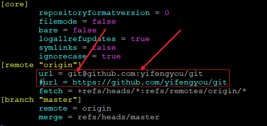

<!-- MDTOC maxdepth:6 firsth1:1 numbering:0 flatten:0 bullets:1 updateOnSave:1 -->

- [git](#git)   
   - [git技巧](#git技巧)   
   - [检索某人(某邮件)提交记录](#检索某人某邮件提交记录)   
   - [统计某公司所有提交记录](#统计某公司所有提交记录)   
   - [修改git时间戳显示](#修改git时间戳显示)   
   - [github/gitee免密登陆](#githubgitee免密登陆)   

<!-- /MDTOC -->
# git

```
Something I hope you know before go into the coding~
First, please watch or star this repo, I'll be more happy if you follow me.
Bug report, questions and discussion are welcome, you can post an issue or pull a request.
```

---

## git技巧


## 检索某人(某邮件)提交记录

命令：

```
git log --author=fflooney
git log --author=fflooney@example.com
```

Demo:

```
git log --author=brookxu@tencent.com --oneline
```

```
[root@X99F8D /linux.git]# git log --author=samuelliao@tencent.com
commit c0a58fb2bdf033df433cad9009c7dac4c6b872b0
Author: Samuel Liao <samuelliao@tencent.com>
Date:   Tue Jun 5 13:14:59 2012 +0800

    perf annotate: Check null of sym pointer before using it

    Sym may be NULL, and that will cause perf to crash.

    Signed-off-by: Shan Wei <davidshan@tencent.com>
    Cc: Ingo Molnar <mingo@redhat.com>
    Cc: Namhyung Kim <namhyung.kim@lge.com>
    Cc: Paul Mackerras <paulus@samba.org>
    Cc: Peter Zijlstra <a.p.zijlstra@chello.nl>
    Link: http://lkml.kernel.org/r/4FCD95D3.90209@gmail.com
    Signed-off-by: Arnaldo Carvalho de Melo <acme@redhat.com>

commit 9bd1be457d2b9568c3c8f8f6b8e450a501bff402
Author: Samuel Liao <samuelliao@tencent.com>
Date:   Fri Apr 27 17:09:27 2012 +0000

    igbvf: fix the bug when initializing the igbvf

    Maybe it's a typo, but it cause that igbvf can't be initialized successfully.
    Set perm_addr value using valid dev_addr, although which is equal to hw.mac.addr.

    Signed-off-by: Samuel Liao <samuelliao@tencent.com>
    Signed-off-by: Shan Wei <davidshan@tencent.com>
    Signed-off-by: Jeff Kirsher <jeffrey.t.kirsher@intel.com>
```


## 统计某公司所有提交记录

命令：

```
git log --format=%ae | grep XXX.com | sort  | uniq -c | sort -n -r
```

粗略估计，部分大神用其他邮箱提交，当然，哪些公司有KPI指标很明显

Demo:

当前提交点 : 57ae8a492116910bad2b3497ffe555b3a4b4180f

```
[root@X99F8D /linux.git]# git log --format=%ae | grep tencent.com | sort  | uniq -c | sort -n -r
    134 wanpengli@tencent.com
     70 kaixuxia@tencent.com
     39 imagedong@tencent.com
     25 likexu@tencent.com
     25 brookxu@tencent.com
     17 davidshan@tencent.com
     15 cloudliang@tencent.com
     10 benbjiang@tencent.com
      9 lihaiwei@tencent.com
      6 tcs_kernel@tencent.com
      4 zhiguohong@tencent.com
      4 flyingpeng@tencent.com
      3 lennychen@tencent.com
      2 samuelliao@tencent.com
      2 herberthbli@tencent.com
      1 yongduan@tencent.com
      1 willzzhang@tencent.com
      1 tonnylu@tencent.com
      1 tombinfan@tencent.com
      1 sumiyawang@tencent.com
      1 ruippan@tencent.com
      1 newtongao@tencent.com
      1 kiyin@tencent.com
      1 juviliu@tencent.com
      1 haibinzhang@tencent.com
      1 dbyin@tencent.com
      1 chengdongli@tencent.com
      1 allanyuliu@tencent.com
```

```
[root@X99F8D /linux.git]# git log --format=%ae  |grep alibaba | sort  | uniq -c | sort -n -r
    250 jiapeng.chong@linux.alibaba.com
    216 yang.lee@linux.alibaba.com
    194 alex.shi@linux.alibaba.com
    119 guoren@linux.alibaba.com
    106 laijs@linux.alibaba.com
     79 tianjia.zhang@linux.alibaba.com
     66 baolin.wang@linux.alibaba.com
...
```


```
[root@X99F8D /linux.git]# git log --format=%ae  |grep baidu | sort  | uniq -c | sort -n -r
    313 caihuoqing@baidu.com
     89 lirongqing@baidu.com
      2 zhangliping02@baidu.com
      2 yuanzhaoxiong@baidu.com
      1 zhaolei27@baidu.com
      1 yangyongqiang01@baidu.com
      1 xieyongji@baidu.com
      1 wangli39@baidu.com
      1 jimyan@baidu.com
```


```
[root@X99F8D /linux.git]# git log --format=%ae  |grep bytedance | sort  | uniq -c | sort -n -r
    124 songmuchun@bytedance.com
     66 cong.wang@bytedance.com
     49 xieyongji@bytedance.com
     18 zhouchengming@bytedance.com
     12 pizhenwei@bytedance.com
     12 peilin.ye@bytedance.com
     10 usama.arif@bytedance.com
      9 zhengqi.arch@bytedance.com
      8 yinxin.x@bytedance.com
      8 jiang.wang@bytedance.com
      5 wangzhiqiang.bj@bytedance.com
      5 ligang.bdlg@bytedance.com
      5 houpu@bytedance.com
      3 zhengfeiran@bytedance.com
      3 qitao.xu@bytedance.com
      3 liuxiaozhou@bytedance.com
      2 yulei.sh@bytedance.com
      2 xuxiaohan@bytedance.com
      2 wangqiang.wq.frank@bytedance.com
      2 lizefan.x@bytedance.com
      2 helei.sig11@bytedance.com
      2 fankaixi.li@bytedance.com
      1 zhoufeng.zf@bytedance.com
      1 zangchunxin@bytedance.com
      1 yanghui.def@bytedance.com
      1 weijunji@bytedance.com
      1 wangwenliang.1995@bytedance.com
      1 wangdongdong.6@bytedance.com
      1 pandong.peter@bytedance.com
      1 liuting.0x7c00@bytedance.com
      1 liuqi.16@bytedance.com
      1 lifei.shirley@bytedance.com
      1 huangkele@bytedance.com
      1 hexin.op@bytedance.com
      1 fam.zheng@bytedance.com
      1 chenying.kernel@bytedance.com
```

```
[root@X99F8D /linux.git]# git log --format=%ae   | sort  | uniq -c | sort -n -r
  31199 torvalds@linux-foundation.org
  13784 davem@davemloft.net
   8894 arnd@arndb.de
   8426 tiwai@suse.de
   6784 hch@lst.de
   6405 chris@chris-wilson.co.uk
   6052 tglx@linutronix.de
   5898 viro@zeniv.linux.org.uk
   4249 gregkh@linuxfoundation.org
   4196 hsweeten@visionengravers.com
   4059 ville.syrjala@linux.intel.com
   4010 kuninori.morimoto.gx@renesas.com
   3948 broonie@opensource.wolfsonmicro.com
   3905 linus.walleij@linaro.org
   3905 airlied@redhat.com
   3827 johannes.berg@intel.com
   3824 dan.carpenter@oracle.com
   3785 acme@redhat.com
   3753 olof@lixom.net
   3726 daniel.vetter@ffwll.ch
   3670 colin.king@canonical.com
   3599 andriy.shevchenko@linux.intel.com
   3521 mingo@elte.hu
   3501 geert+renesas@glider.be
   3430 bskeggs@redhat.com
   3342 alexander.deucher@amd.com
   3296 joe@perches.com
   3199 rafael.j.wysocki@intel.com
   3182 tj@kernel.org
   3131 hdegoede@redhat.com
   3010 lee.jones@linaro.org
   2957 broonie@kernel.org
   2857 edumazet@google.com
   2854 dhowells@redhat.com
   2630 tony@atomide.com
   2543 lethal@linux-sh.org
   2539 rmk+kernel@arm.linux.org.uk
   2484 mingo@kernel.org
   2419 lars@metafoo.de
   2261 peterz@infradead.org
   2205 ebiederm@xmission.com
```

如果你想知道是否有人用163邮箱，qq邮箱

```
git log --format=%ae | grep qq.com
git log --format=%ae | grep 163.com
```


同理检索提交者最多使用什么邮箱，怎么操作

```
git log --format=%ae | cut -d'@' -f2 | sort | uniq -c | sort -n -r
```

可以看出，大部分使用的是gmail，但是国内玩不了gmail，虽然网易邮箱可以，但是速度比较尴尬

```
 102949 @gmail.com
  61035 @intel.com
  58904 @redhat.com
  35467 @kernel.org
  32694 @linux-foundation.org
  28392 @linaro.org
  25508 @amd.com
  24940 @linux.intel.com
  21277 @suse.de
  16788 @google.com
  16052 @oracle.com
  15603 @huawei.com
  15453 @ti.com
  13784 @davemloft.net
  13210 @samsung.com
  11164 @linux.vnet.ibm.com
  10683 @mellanox.com
  10070 @arm.com
   9578 @nvidia.com
   8894 @arndb.de
   7853 @broadcom.com
   7846 @infradead.org
   7805 @linutronix.de
   7546 @codeaurora.org
   6975 @canonical.com
   6888 @chromium.org
   6806 @lst.de
   6763 @nxp.com
   6563 @pengutronix.de
   6562 @suse.com
   6405 @chris-wilson.co.uk
   6045 @visionengravers.com
   5950 @renesas.com
   5898 @zeniv.linux.org.uk
   5887 @suse.cz
   5553 @freescale.com
   5357 @de.ibm.com
```


## 修改git时间戳显示

全局配置，时间为本机时间，确保本机时间为CST则为北京时间

```
git config --global log.date format-local:'%Y-%m-%d %H:%M:%S(Beijing)' --replace-all
```


## github/gitee免密登陆

* 经验总结，使用https/http访问github极不稳定（国内环境）相比而言
* 墙裂推荐使用 ssh 方式


如何将现有仓库的上游调整，命令也行，但是我更喜欢上去直接改配置文件



将url字段内容调整为git，格式为

```
git@XXXX:/NAMESPACE/REPOSITORY_NAME
```


这里需要分一下，公钥私钥，不管你熟悉不熟悉，

* 公钥就是公开的，as we know, all is well
* 私钥肯定不公开撒，你的小秘密只有你自己知道

github/gitee端授信的肯定是公钥，然后你用你的"小秘密"访问

如果github/gitee端授信的是私钥，那么你的小秘密，任何人用"all is well"都能解开，那还安全个毛毛？

因此，需要针对github/gitee/gitlab分别生成一套公私钥。当然，你要是够懒，用同一套，没人拦着。不过，这东西毕竟免密，只需要刚开始配置一套即可，代价较小（程序员偷懒思维）。

首先，公钥甩哪里去？


然后，私钥甩哪里去？

* 修改```~/.ssh/config```，添加条目，指定IdentityFile到路径
* 有能基于当前repo的id file配置？有也暂时不用，因为，懒

```
$ cat ~/.ssh/config

Host gitee.com
  HostName gitee.com
  IdentityFile ~/.ssh/gitee_yifengyou

Host github.com
  HostName github.com
  IdentityFile ~/.ssh/github_yifengyou
```


---
